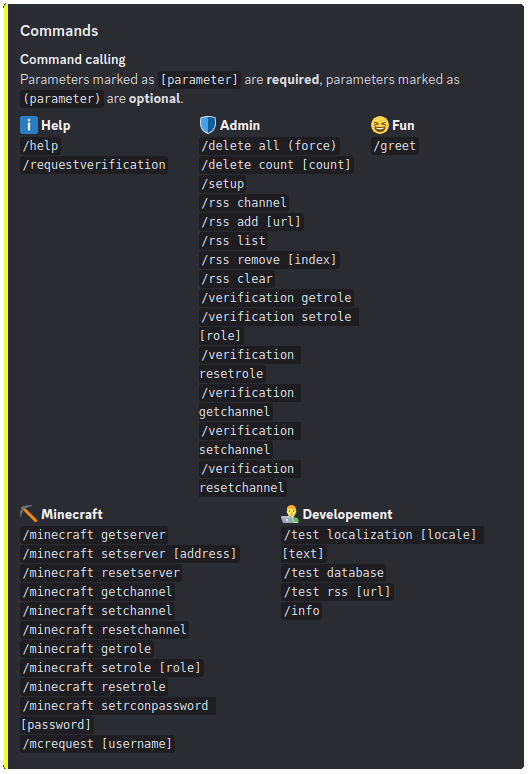

# Lojza bot

Discord bot who is quite Lojza. It has many features such as message deletion, Discord server settings, command localization and RSS feed subscription. And that's pretty much it in this version.



## Running in Docker

Just configure [environment variables](#enviroment-variables) in `docker-compose.yml` and run these commands from project root folder:

```bash
sudo docker build -t jsfraz/lojza:1.0.0 .
sudo docker compose up -d
```

## Enviroment variables

| Variable            | Required | Default | Description                                    |
|---------------------|----------|---------|------------------------------------------------|
| DISCORD_TOKEN       | yes      |         | Discord bot token                              |
| MONGO_USER          | no       | lojza   | MongoDB user                                   |
| MONGO_PASSWORD      | yes      |         | MongoDB password                               |
| MONGO_SERVER        | yes      |         | MongoDB server                                 |
| MONGO_PORT          | no       | 27017   | MongoDB port                                   |
| MONGO_DATABASE      | no       | lojza   | MongoDB database name                          |
| MONGO_TIMEOUT       | no       | 100     | MongoDB timeout (milliseconds)                 |
| RSS_REFRESH_MINUTES | no       | 60      | RSS refresh interval (minutes from 15 to 1440) |
